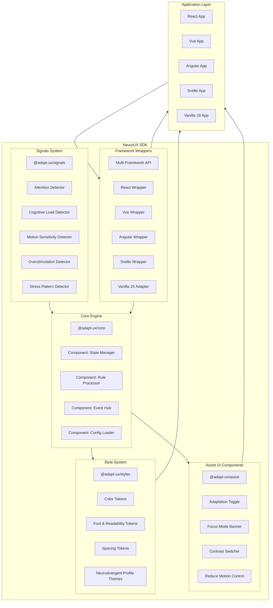

# 🏛️ **NeuroUX SDK — Architecture Overview**

This document describes the internal architecture, principles, modules, and structure of the **NeuroUX SDK**, developed by **AdaptUX**.
It explains how the system works, how packages communicate, and how adaptations are processed from detection → evaluation → UI rendering.

---

# 📂 **1. Monorepo Structure (Nx)**

The project uses **Nx** to manage a modular and scalable monorepo.
All parts of the NeuroUX SDK are organized as independent packages:

```
neuro-ux-sdk/
 ├─ apps/
 │   └─ demo/                    → Example playground
 ├─ packages/
 │   ├─ core/                    → Adaptive engine (framework-agnostic)
 │   ├─ assist/                  → Web Components UI (Lit)
 │   ├─ styles/                  → SCSS tokens (themes, utilities)
 │   ├─ signals/                 → Heuristics & behavior detection
 │   ├─ utils/                   → Helper utilities
 │   ├─ react/                   → React wrapper
 │   ├─ vue/                     → Vue plugin wrapper
 │   ├─ angular/                 → Angular directives / provider
 │   ├─ svelte/                  → Svelte store integration
 │   └─ js/                      → Vanilla JS adapter
 ├─ docs/
 └─ tools/
```

### Why Nx?

* Faster builds (caching + incremental computation)
* Isolated package boundaries
* Standardized tooling across frameworks
* Ability to test packages individually
* Automatic dependency graph

---

# 🧠 **2. Core Concepts**

The NeuroUX SDK architecture is built around **three pillars**:

## **1) Detect**

Interpret user behavior and cognitive signals.

## **2) Evaluate**

Apply adaptive rules and heuristics.

## **3) Adapt**

Change UI tokens, behavior, or components.

This “DEA loop” repeats continuously, similar to an accessibility-focused feedback loop.

---

# 🔌 **3.Architecture Diagram**




---

# 🧩 **4. Package-by-Package Architecture**

---

## **4.1 @adapt-ux/core — Adaptive Engine**

The heart of the SDK.

### Responsibilities:

* Engine initialization (`createNeuroUX`)
* Global adaptive state store
* Rule evaluator
* Orchestrates signals + UI responses
* Exposes a consistent API to all frameworks
* Emits events (e.g. `adapt:modeChanged`)
* Loads configuration (JSON or JS)

### Core internal modules:

* **State Manager**
* **Signal Combiner**
* **Rule Processor**
* **Adaptation Dispatcher**

---

## **4.2 @adapt-ux/signals — Detection Layer**

Responsible for monitoring user behavior and sensory patterns.

### Types of signals:

* **Attention**: idle, rapid switching, scroll velocity
* **Cognitive Load**: reading speed, scanning behavior
* **Overstimulation**: rapid pointer movement, oscillation
* **Motion Sensitivity**: high avoidance of animated areas
* **Stress Indicators**: inconsistencies in navigation patterns

### Output:

Signals emit values like:

```ts
{ focusLevel: 0.72, motionSensitivity: 0.44 }
```

These feed the **core engine**.

---

## **4.3 @adapt-ux/styles — SCSS Token Engine**

Controls all adaptive visual layers.

Includes:

* color tokens
* spacing adjustments
* font readability presets
* themes for neurodivergent profiles
* high-contrast & soft-contrast modes
* dynamic CSS variable injection

Design system inspired by:

* W3C accessibility guidelines
* Cognitive design heuristics
* Human-factors research

---

## **4.4 @adapt-ux/assist — Adaptive Web Components**

UI layer built using **Lit Web Components**.

Includes:

* Adaptation Toggle Widget (puzzle icon)
* Focus Mode Banner
* Contrast / Motion / Reading toggles
* Cognitive simplification UI

Features:

* Works in any framework
* Accessible by default (ARIA standards)
* Theming via CSS tokens
* Small footprint + tree-shakable

---

## **4.5 Framework Wrappers**

These packages adapt the core engine to each framework’s idioms.

### React

* Context provider
* Hooks like `useNeuroUX()`

### Vue

* Plugin installer
* Composition API access

### Angular

* Standalone provider
* Structural directives

### Svelte

* Stores integration

### JS

* Simple loader
* No build tools required

---

# 🔄 **5. Adaptation Flow**

This is how a UI adaptation happens:

```txt
User → Signal Detectors → Core Engine → Rule Processor → Styles / Assist UI → Framework Wrapper → App UI
```

Detailed:

1. **Signal detectors** observe user behavior
2. They emit state into the engine
3. **Core engine** evaluates rules like:

```
if load > 0.8 → simplify layout
if motionSensitivity > 0.6 → reduce animations
```

4. Engine triggers UI updates:

   * CSS variables
   * Assist components
   * Framework event bindings

5. Framework wrappers reflect changes in React/Vue/etc.

---

# 🛡️ **6. Design Principles**

### **1) Non-intrusive**

Adaptations must respect user autonomy.

### **2) Privacy-first**

Signals never store personal data.

### **3) Research-backed**

Every adaptation is grounded in cognitive or accessibility research.

### **4) Framework-agnostic core**

The “brain” is independent of tools.

### **5) Extensible**

New heuristics and plugins can be added.

---

# 🧬 **7. Future Architecture Extensions**

Planned additions:

* Plugin marketplace
* ML-assisted adaptation suggestions (local-only)
* Browser extension mode
* Mobile SDK layer
* Shared preset profiles for ADHD / Autism / Dyslexia / Sensory

---

# 📎 **8. Related Documents**

* [Roadmap](../roadmap/ROADMAP.md)
* [Contributing Guide](../../CONTRIBUTING.md)
* [Security Policy](../../SECURITY.md)

---
